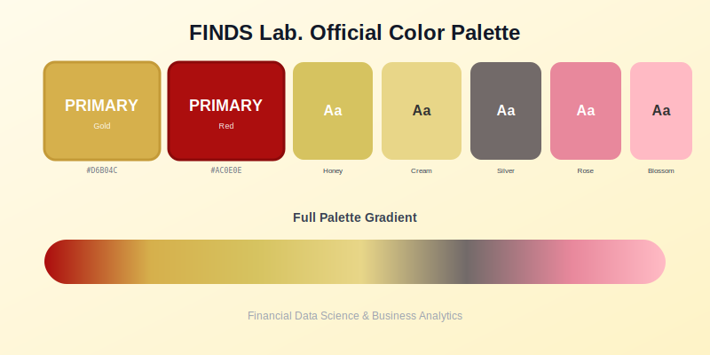

FINDS Lab.의 공식 컬러 팔레트를 소개합니다.

## Primary Colors

**FINDS Gold** — RGB 214, 177, 77 / #D6B14D
메인 브랜딩, 박사과정, 저널 논문, 업적 표시에 사용됩니다.

**FINDS Red** — RGB 172, 14, 14 / #AC0E0E
CTA 버튼, 중요 하이라이트, 링크, 컨퍼런스 논문에 사용됩니다.

## Secondary Colors

**FINDS Honey** — #D6C360
보조 골드, 현재 연도 하이라이트, NEW 배지

**FINDS Cream** — #E8D688
도서, 밝은 배경, 미묘한 하이라이트

**FINDS Coral** — #D6A076
따뜻한 전환 효과, 배너 오버레이

## Accent Colors

**FINDS Rose** — #E8889C
석사과정, 보조 요소

**FINDS Blossom** — #FFBAC4
학부연구생, 리포트, 부드러운 배경

---

> 이 컬러 팔레트는 FINDS Primary Gold와 FINDS Primary Red를 메인 브랜드 아이덴티티로 사용합니다.
